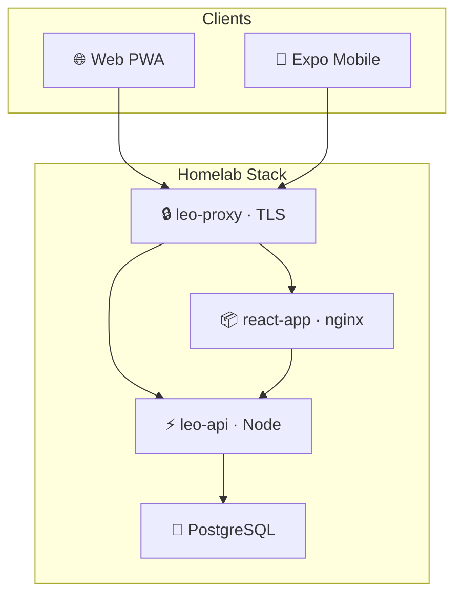

  

# Sky Office Homelab

**Official repository · Employment agency operations platform**

*Passport onboarding → work permits → payroll → billing — one system for Leo Employment Services*

 

---

## ✨ Purpose

**Sky Office** *(LEO OS)* is the internal operations platform for **Leo Employment Services** — built to run the full lifecycle of overseas workers in the Maldives, from first passport scan through payroll and client invoicing.

<table>
<tr>
<td width="50%" valign="top">

### 🛂 Onboarding
- AI **passport OCR** → employee records
- Auto-generated **Letters of Appointment**
- Emergency contact capture & LOA sync

</td>
<td width="50%" valign="top">

### 📋 Operations
- **Master list** with work permits & job titles
- **Xpat** integration & expiry alerts
- Company-linked credentials & permissions

</td>
</tr>
<tr>
<td width="50%" valign="top">

### 💰 Finance
- Invoices, quotations & expense vouchers
- Salary roster with margin tracking
- Client billing with import from payroll

</td>
<td width="50%" valign="top">

### 📊 Insight & access
- Dashboard KPIs, charts & task board
- Installable **web PWA** for admins
- **Expo mobile** app for field staff

</td>
</tr>
</table>

---

## 🏗 Architecture

| Layer | Technology |
|:------|:-----------|
| 🖥 **Web** | React 19 · Vite · shadcn/ui · TanStack Query |
| 📱 **Mobile** | Expo · React Native |
| ⚡ **API** | Express · Drizzle ORM · OpenAI OCR |
| 🗄 **Data** | PostgreSQL 17 |
| 🚀 **Deploy** | Docker Compose · nginx reverse proxy |

---

 

**Sky Office** · Leo Employment Services

*Self-hosted homelab deployment*

 

