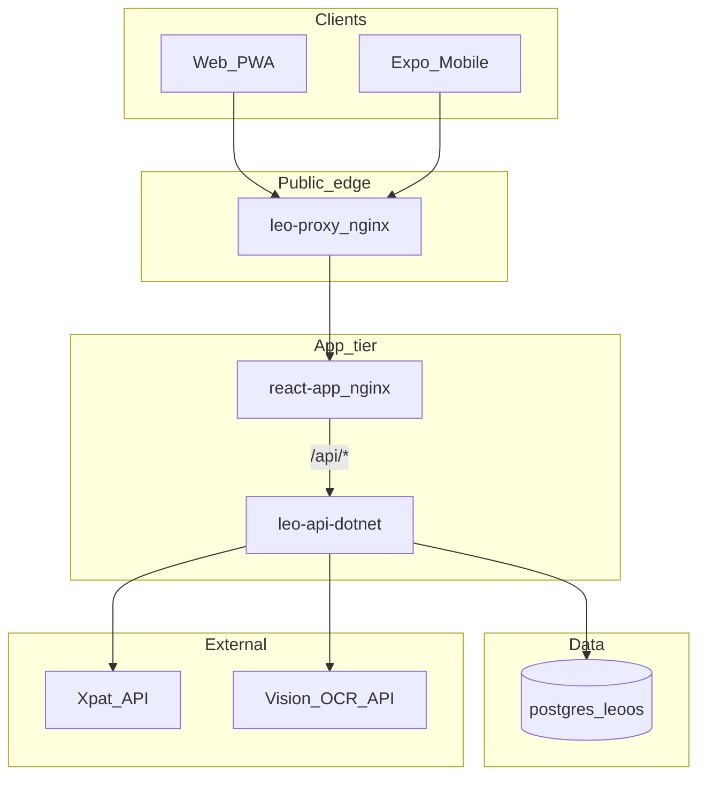

<div align="center">


<br /><br />

# Sky Office

**Employment agency operations platform · Leo Employment Services (Maldives)**

*Passport OCR → work permits → Letters of Appointment → payroll → client billing*

<br />

[](https://nodejs.org/)
[](https://www.typescriptlang.org/)
[](https://react.dev/)
[](https://vitejs.dev/)
[](https://expo.dev/)
[](https://dotnet.microsoft.com/)
[](docs/ANDROID-APPS.md)
[](https://www.postgresql.org/)
[](https://docs.docker.com/compose/)
[](https://tailscale.com/)

</div>

---

> **README rule:** Before any `git push`, update this README so it matches how the system currently works (architecture, URLs, stack, migration status). Ask the agent to refresh it when you are about to push.

---

## What Sky Office is

Sky Office (**LEO OS**) is a **self-hosted** internal ERP for a Maldives recruitment / manpower agency. Office staff use an installable **web PWA**; field staff use **native Android** (`leo-android`) plus optional **SMS gateway** phones. Everything talks to one **ASP.NET Core** API backed by **PostgreSQL**.

<table>
<tr>
<td width="25%" valign="top">

### Onboarding
- Passport **OCR** (vision API)
- Employee master records
- Auto **LOA** on complete
- Emergency contact sync

</td>
<td width="25%" valign="top">

### Operations
- Master list + job titles
- Company / client allocation
- **Xpat** work-permit status
- Expiry alerts on dashboard

</td>
<td width="25%" valign="top">

### Finance
- Monthly **salary** roster
- Client invoices / quotes
- Salary → invoice import
- Categorized **expenses**

</td>
<td width="25%" valign="top">

### Access
- RBAC (6 roles)
- Company password vault
- Tasks on dashboard
- Tailscale + LAN HTTPS

</td>
</tr>
</table>

---

## How the system works (request path)



| Access | URL | Notes |
|--------|-----|-------|
| PC on home Wi‑Fi | `https://192.168.18.150/` | Self-signed TLS on `leo-proxy` |
| Phone over Tailscale | `http://100.126.222.96/` | HTTP over WireGuard |
| Mobile API base | `http://100.126.222.96` | `EXPO_PUBLIC_API_URL` |

Flow in words:

1. Browser/app hits **leo-proxy** (LAN `:443` TLS, Tailscale `:80` HTTP).
2. Proxy forwards to **react-app** (static SPA).
3. `/api/*` is reverse-proxied to **leo-api-dotnet** (ASP.NET Core on `:8080`).
4. API uses **cookie sessions** (`leo.sid`) or **Bearer** session id (mobile), Postgres store `session`.
5. OCR / Xpat are outbound calls from the API.

---

## Repositories

| Repo | Role |
|------|------|
| **This tree** → [sky_office_homelab](https://github.com/adhuhaam/sky_office_homelab) (`origin`) | Canonical homelab + nested app source |
| [sky-office](https://github.com/adhuhaam/sky-office) | Extra remote — different history; see [docs/GITHUB.md](docs/GITHUB.md) |

Push to `origin` after committing so GitHub matches this server’s **code**. DB/secrets/Cursor need the DR layers in [docs/DISASTER-RECOVERY.md](docs/DISASTER-RECOVERY.md).

---

## Layout (homelab)

```
apps/
├── docker-compose.yml      # postgres · leo-api-dotnet · react-app · leo-proxy
├── api/.env                # API secrets (not committed)
├── react/app/              # Built PWA (pnpm deploy:web)
├── infra/nginx + certs     # Public proxy + LAN TLS
├── scripts/                # go-live.sh · run-dotnet-api.sh · …
├── docs/                   # System documentation (start: docs/SYSTEM-MAP.md)
├── leo-os/                 # React PWA + Expo (reference)
├── leo-os-dotnet/          # ASP.NET Core API (+ SMS/Notification)
├── leo-android/            # Native admin Compose app
└── leo-sms-gateway/        # Android SIM SMS nodes
```

---

## Stack bubbles

| Bubble | Detail |
|--------|--------|
| **Web** | React 19 · Vite · shadcn/ui · TanStack Query · wouter · PWA |
| **Mobile** | Native Compose (`leo-android`); Expo = reference only |
| **API** | ASP.NET Core 8 · EF Core · Npgsql · cookie sessions |
| **SMS** | SignalR hub + queue · multi-device nodes · one default |
| **DB** | PostgreSQL 17 · database `leoos` |
| **OCR** | OpenAI-compatible vision (`OPENAI_*` / `DEEPSEEK_*`) |
| **Deploy** | Docker Compose · network `homelab` |

---

## Roles (RBAC)

`superuser` → `admin` → `company` / `client` / `agent` / `employee`

---

## Core workflows (short)

1. **New worker** — upload passport → OCR → company → employment → auto LOA  
2. **Payroll** — salary draft → confirm → import into invoice  
3. **Work permits** — WP + passport numbers → live Xpat → dashboard alerts  

Details: [`docs/WORKFLOWS.md`](docs/WORKFLOWS.md).

---

## Backup, DR & .NET

| Topic | Doc |
|-------|-----|
| Project freeze | [docs/BACKUP-AND-RESTORE.md](docs/BACKUP-AND-RESTORE.md) |
| Git + archives + system/Cursor | [docs/DISASTER-RECOVERY.md](docs/DISASTER-RECOVERY.md) |
| .NET rewrite status | [docs/MIGRATION-DOTNET.md](docs/MIGRATION-DOTNET.md) |

```bash
sudo bash /home/adhuhaam/apps/scripts/go-live.sh
cd /home/adhuhaam/apps/leo-os && pnpm deploy:web
cd /home/adhuhaam/apps && docker compose build leo-api-dotnet && docker compose up -d --force-recreate leo-api-dotnet
```

---

## Documentation index

Full index: [`docs/README.md`](docs/README.md) · map: [`docs/SYSTEM-MAP.md`](docs/SYSTEM-MAP.md)

| Doc | Contents |
|-----|----------|
| [docs/SYSTEM-MAP.md](docs/SYSTEM-MAP.md) | One-page system map |
| [docs/ARCHITECTURE.md](docs/ARCHITECTURE.md) | Services & packages |
| [docs/FEATURES.md](docs/FEATURES.md) | Modules |
| [docs/WORKFLOWS.md](docs/WORKFLOWS.md) | End-to-end flows |
| [docs/DATA-MODEL.md](docs/DATA-MODEL.md) | Tables |
| [docs/API.md](docs/API.md) | REST map |
| [docs/AUTH.md](docs/AUTH.md) | Sessions & roles |
| [docs/DEPLOYMENT.md](docs/DEPLOYMENT.md) | Ship checklist |
| [docs/OPERATIONS.md](docs/OPERATIONS.md) | URLs & scripts |
| [docs/DEVELOPMENT.md](docs/DEVELOPMENT.md) | pnpm + .NET |
| [docs/ENVIRONMENT.md](docs/ENVIRONMENT.md) | Env vars |
| [docs/GITHUB.md](docs/GITHUB.md) | Remotes |
| [docs/BACKUP-AND-RESTORE.md](docs/BACKUP-AND-RESTORE.md) | Backup / restore |
| [docs/DISASTER-RECOVERY.md](docs/DISASTER-RECOVERY.md) | 3-layer DR |
| [docs/MIGRATION-DOTNET.md](docs/MIGRATION-DOTNET.md) | ASP.NET rewrite |

---

<div align="center">

**Sky Office** · Leo Employment Services  
*Self-hosted · LAN + Tailscale*

</div>
