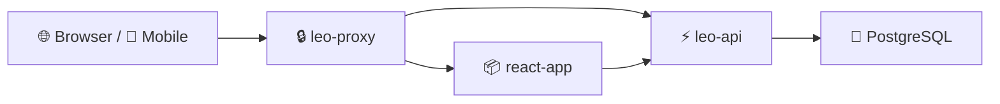

<div align="center">

# 🏢 Sky Office Homelab

**Official repository for Sky Office — employment agency operations platform**

[](https://nodejs.org/)
[](https://pnpm.io/)
[](https://docs.docker.com/compose/)
[](https://www.postgresql.org/)
[](https://react.dev/)
[](https://expo.dev/)

</div>

---

## ✨ Purpose

**Sky Office** (LEO OS) is the internal operations platform for **Leo Employment Services** — managing the full lifecycle of overseas workers in the Maldives:

| Area | What it covers |
|------|----------------|
| 🛂 **Passport OCR** | AI extraction from passport scans → employee records |
| 📋 **Master List** | Candidates, work permits, Xpat integration, job titles |
| 📄 **LOA** | Letters of Appointment — auto-generated on onboarding |
| 💰 **Billing & Salary** | Invoices, quotations, payroll, margin tracking |
| 📊 **Dashboard** | KPIs, work permit alerts, expense & invoicing charts, tasks |
| 📱 **Mobile** | Expo app for field staff (upload, master list, billing) |
| 🔐 **Admin** | Companies, clients, users, permissions, credentials |

---

## 📁 Repository layout

```
sky_office_homelab/
├── leo-os/              # Monorepo — web, API, mobile, shared packages
│   ├── apps/web         # Vite + React PWA (admin UI)
│   ├── apps/api         # Express REST API
│   ├── apps/mobile      # Expo React Native
│   ├── packages/db      # Drizzle ORM schema
│   └── docs/            # Architecture, features, deployment
├── docker-compose.yml   # Production stack (proxy, web, API, postgres)
├── infra/               # nginx TLS proxy config
├── api/                 # API runtime env (.env.example)
├── react/               # nginx config for static web
└── scripts/             # Helper scripts
```

---

## 🚀 Quick start

```bash
# Clone
git clone https://github.com/adhuhaam/sky_office_homelab.git
cd sky_office_homelab

# Local development (monorepo)
cd leo-os && pnpm install
pnpm --filter @leo/api run dev    # API
pnpm --filter @leo/web run dev    # Web
pnpm mobile:dev                   # Mobile

# Production deploy
cd leo-os && pnpm deploy:web
cd .. && docker compose build leo-api && docker compose up -d --force-recreate leo-api
```

Copy `api/.env.example` → `api/.env` and set secrets before starting the stack.

---

## 📚 Documentation

Detailed docs live in [`leo-os/docs/`](leo-os/docs/):

- [Features](leo-os/docs/FEATURES.md) — every module
- [Workflows](leo-os/docs/WORKFLOWS.md) — OCR, LOA, billing flows
- [Architecture](leo-os/docs/ARCHITECTURE.md) — auth, API, OCR pipeline
- [Deployment](leo-os/docs/DEPLOYMENT.md) — production checklist
- [Data model](leo-os/docs/DATA-MODEL.md) — database schema

---

## 🏗 Stack



---

<div align="center">

**Sky Office** · Leo Employment Services · Homelab deployment

</div>
