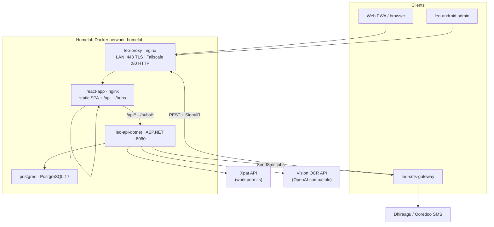
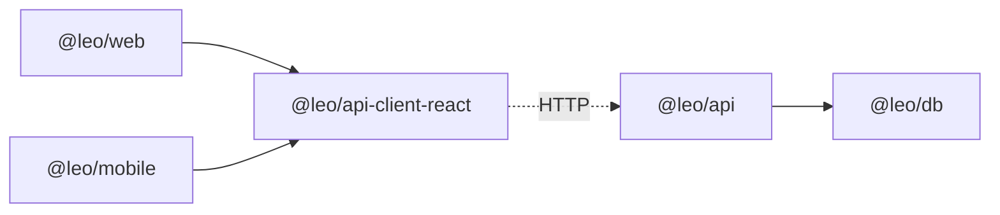

# Architecture

## High-level request flow

1. Browser or Android clients hit **leo-proxy** (public entry).
2. Proxy forwards to **react-app**.
3. react-app serves static `/`; proxies `/api/` and `/hubs/` to **leo-api-dotnet**.
4. API reads/writes **Postgres**, calls Xpat/OCR, and pushes SMS jobs to online gateways over SignalR.

### Dual access model

| Path | How TLS works |
|------|----------------|
| LAN `https://192.168.18.150` | Self-signed cert on leo-proxy; browser accepts once |
| Tailscale `http://100.126.222.96` | Plain HTTP at app layer; WireGuard encrypts the tunnel |

HTTP on the Tailscale IP avoids self-signed cert failures on phones and React Native. Do not expose that IP outside the tailnet.

## Docker services

Defined in [`docker-compose.yml`](../docker-compose.yml). Network: external `homelab`.

| Container | Image / build | Host ports | Role |
|-----------|---------------|------------|------|
| `postgres` | `postgres:17` | none (internal) | Database (`leoos`) |
| `leo-api-dotnet` | build `leo-os-dotnet` → `Dockerfile` | none (`:8080` internal) | ASP.NET Core API |
| `react-app` | `nginx:alpine` | none (`:80` internal) | SPA + `/api` proxy |
| `leo-proxy` | `nginx:alpine` | `192.168.18.150:80/443`, `100.126.222.96:80` | Public TLS / HTTP entry |

Config mounts:

- Proxy config: `infra/nginx/leo-os-docker.conf`
- App nginx: `react/nginx/default.conf`
- TLS: `infra/certs/{cert,key}.pem`
- API env: `api/.env`
- Postgres data: `postgresql/data/`

## Monorepo packages (`leo-os/`)

| Package | Path | Role |
|---------|------|------|
| `@leo/api` | `apps/api` | Legacy Express (rollback only) |
| `@leo/web` | `apps/web` | Vite React admin UI (PWA) |
| `@leo/mobile` | `apps/mobile` | Expo React Native app |
| `@leo/db` | `packages/db` | Drizzle schema + `getPool()` |
| `@leo/api-client-react` | `packages/api-client-react` | Shared TanStack Query hooks / types |

## API internals

Primary: `leo-os-dotnet/LeoOs.Api` (controllers + session/permissions middleware).

- **CORS** — multi-origin from `CORS_ORIGIN`; credentials enabled
- **Forwarded headers** — behind nginx
- **Body limit** — Kestrel 20 MB; nginx upload 20 MB for passport files
- **Sessions** — cookie `leo.sid` + `session` table (connect-pg-simple compatible)
- Express source retained under `leo-os/apps/api` for rollback reference

Auth and public routes: [AUTH.md](AUTH.md) · [API.md](API.md).

## OCR pipeline

`.NET` `OcrService` (+ Node `apps/api/src/lib/ocr.ts` for reference):

1. Call vision chat/completions with structured JSON prompt (OpenAI-compatible)
2. Persist to `passports`; on hard failure delete draft row

Config order: Settings UI (`app_settings`) → env `OPENAI_*` / `DEEPSEEK_*`.

## Xpat integration

`.NET` `XpatController` (+ Node `lib/xpat.ts` for reference):

- Live work-permit status, photo, card
- Dashboard alerts: `GET /api/passports/work-permit-alerts`

## Money math (single source of truth)

`LeoOs.Infrastructure/Services/Money.cs` (Node `money.ts` mirrored for web labels):

- `netSalary = basicSalary × daysWorked + allowances − deductions + otherExpenses`
- `clientBillTotal = clientSalary × daysWorked`

## Web app

- Vite + React 19, **wouter** routing, shadcn/Radix UI, Tailwind 4
- Primary data loading via `apiFetch` + session cookies
- PWA: `vite-plugin-pwa`, service worker update prompt
- Role gates in `App.tsx` / `protected-route.tsx`

## Mobile app

- Expo Router under `apps/mobile/app/`
- Bearer token from `GET /api/auth/mobile-token`, stored in Secure Store
- `EXPO_PUBLIC_API_URL` (production: `http://100.126.222.96`)
- Android cleartext HTTP enabled for Tailscale IP
- Print flows open web print URLs in browser

## Nginx layers

**leo-proxy** (`infra/nginx/leo-os-docker.conf`):

| server_name | Port | Behavior |
|-------------|------|----------|
| `192.168.18.150` | 80 | 301 → HTTPS |
| `100.126.222.96` | 80 | Proxy → `react:80` (HTTP) |
| `192.168.18.150` | 443 | TLS → `react:80` |
| `_` default | 80 | 301 → HTTPS |

**react-app** (`react/nginx/default.conf`):

- `/api/` → `http://leo-api-dotnet:8080`
- `/` → SPA `try_files`
- No-cache headers for SW / workbox / manifest

Legacy host nginx (`infra/nginx/leo-os.conf`) is **inactive** when Docker leo-proxy owns 80/443.

## ASP.NET Core API (primary)

Production upstream is `leo-api-dotnet` (`apps/leo-os-dotnet/`). Same Postgres schema and `/api/*` contract. Express Dockerfile kept for rollback. See [MIGRATION-DOTNET.md](MIGRATION-DOTNET.md).

## Related

- [API.md](API.md) — route table
- [DATA-MODEL.md](DATA-MODEL.md) — schema
- [DEPLOYMENT.md](DEPLOYMENT.md) — how artifacts are built and shipped
