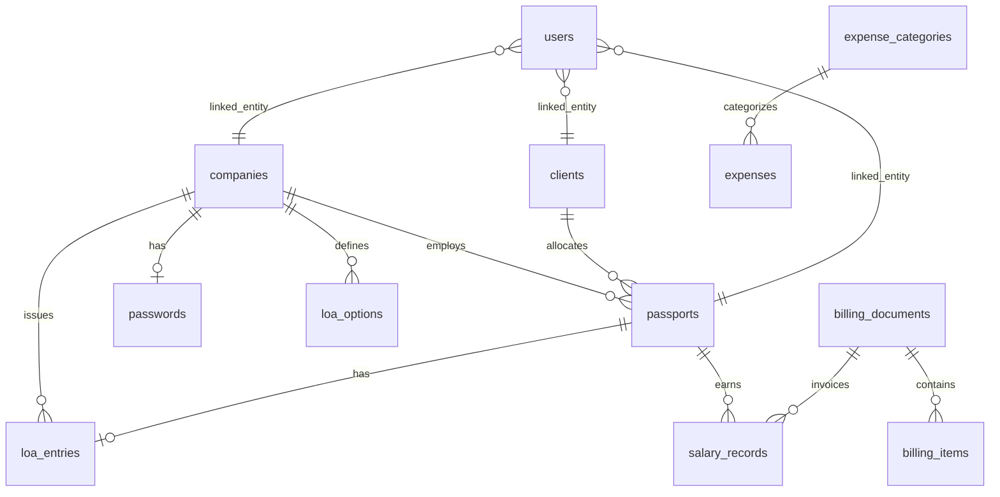

# Data model

Schema: `leo-os/packages/db/src/schema/`. ORM: Drizzle. Database: Postgres (`leoos` in API URL; compose may also set a service-level DB name — API `DATABASE_URL` is authoritative).

Schema push (dev): `pnpm --filter @leo/db run push`  
Production also applies bootstrap alters/seeds in `apps/api/src/lib/bootstrap.ts` on startup.

---

## Entity relationships

---

## Core tables

### `passports` (employees / candidates)

| Column | Notes |
|--------|-------|
| `id` | Serial PK |
| `full_name`, `passport_number` | From OCR |
| `date_of_birth`, `date_of_issue`, `date_of_expiry` | Dates as text |
| `address`, `nationality` | Nationality normalized codes |
| `emergency_contact_name`, `emergency_contact_phone` | Optional OCR/manual |
| `status` | `processing`, `completed`, `failed` |
| `submitted` | Workflow flag |
| `company_id`, `client_id` | FKs |
| `work_permit_number` | For Xpat |
| `agency_salary`, `client_salary`, `agent_rate` | Daily rates |
| `employee_type` | e.g. casual, permanent |

### `loa_entries`

One LOA per passport (enforced in API). Fields: `job_title`, `work_type`, `work_site`, salary/payment/hours/status/duration, `candidate_emergency_contact` (`"Name, Phone"`).

Joined to passports for master-list `jobTitle`.

### `loa_options`

Company-scoped dropdown values. `category`: `job_title` | `work_type` | `work_site`.

### `companies`

Name, address, contact, branding images, signatory, bank details, registration number.

### `clients`

Employer clients.

### `passwords`

One row per `company_id` (unique): Efaas + Gmail credentials.

### `salary_records`

| Column | Notes |
|--------|-------|
| `passport_id` | FK |
| `month`, `year` | Period |
| `days_worked` | Required on confirm |
| `basic_salary`, `client_salary` | Daily rates |
| `net_salary` | Computed on save |
| `status` | `draft`, `confirmed` |
| `invoice_id` | Set when imported to billing |

### `billing_documents` + `billing_items`

Header (invoice/quotation, GST, status) + line items. May link salary IDs for cost/profit.

### `expenses` + `expense_categories`

Amount, date, category, remarks. Category delete blocked if expenses reference it.

### `tasks`

Title, notes, status, priority, due date, `parent_id` for subtasks.

### `users` + `role_permissions` + `session`

Auth and RBAC. `linked_entity_id` scopes company/client/employee users. Sessions in `session` (connect-pg-simple).

### `app_settings`

Singleton: branding + OCR configuration.

Schema modules also export `roles` helpers from `roles.ts`.

---

## Computed / not stored

| Data | Source |
|------|--------|
| Xpat WP status / photo | Live via `lib/xpat.ts` |
| WP alerts | Aggregated Xpat + passport WP numbers |
| Billing profit | client bill − salary cost from linked records |
| Dashboard charts | Client aggregation of expenses/billing |

---

## Important API joins

| Endpoint | Join | Purpose |
|----------|------|---------|
| `GET /passports` | `loa_entries` | `jobTitle` in master list |
| `GET /salary-records` | passports + LOA | `passportNumber`, `jobTitle` |
| `GET /passports/work-permit-alerts` | passports + Xpat | Expiry alerts |
