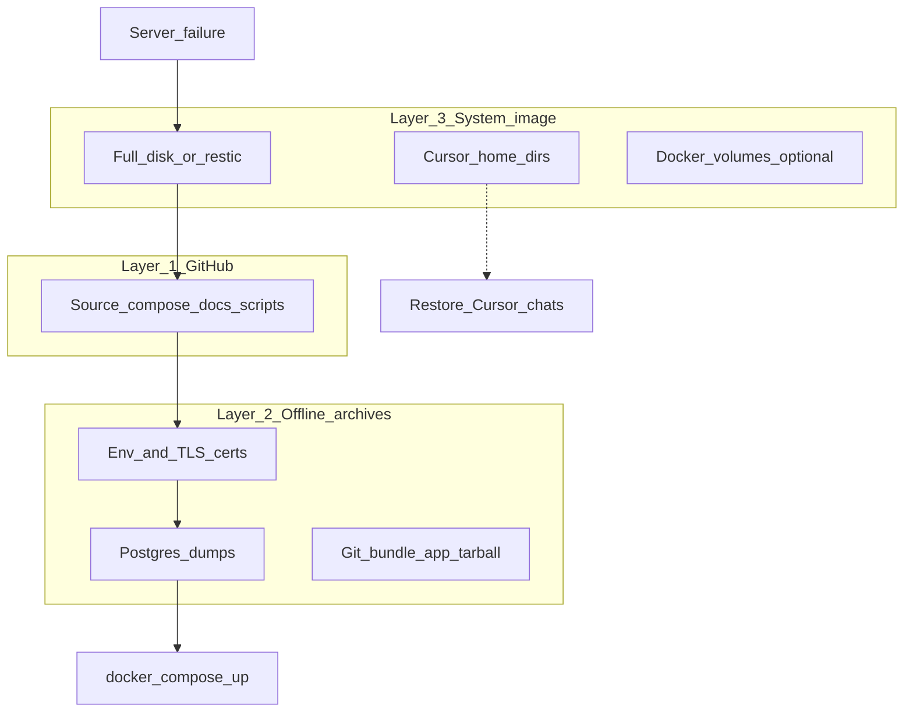

# Disaster recovery — three layers

Goal: if this server is lost or badly broken, restore **Sky Office** and optionally Cursor workspace state.

**Git alone is not a full server backup.** Use all three layers below.



---

## Layer 1 — GitHub (code & config)

**Purpose:** Rebuild the project tree and deploy recipes.

| Item | In Git? |
|------|---------|
| `leo-os/` source, `docs/`, `scripts/`, compose, nginx configs | Yes |
| `api/.env`, `postgresql/.env`, `infra/certs/*.pem` | **No** |
| `postgresql/data/`, `node_modules/`, `react/app/` | **No** (data via dump; web via `pnpm deploy:web`) |
| Cursor chat / agent history | **No** (Layer 3) |

**Canonical clone on this server:** `/home/adhuhaam/apps`  
**Default remote (`origin`):** [sky_office_homelab](https://github.com/adhuhaam/sky_office_homelab)

See [GITHUB.md](GITHUB.md) for remotes and “server ↔ GitHub should match.”

**Before push:** update root [README.md](../README.md) when asked so the public how-it-works page stays current.

---

## Layer 2 — Offline project archives (data + secrets)

**Purpose:** Restore database and secrets without relying on live disk.

Latest freeze (2026-07-14):

`/home/adhuhaam/backups/sky-office-20260714-1442/`

Details and restore commands: [BACKUP-AND-RESTORE.md](BACKUP-AND-RESTORE.md).

**Critical:** copy this directory (or newer archives) to **another machine / NAS / encrypted cloud**. A backup that only lives on the same disk dies with the server.

Recommended cadence:

| Artifact | Frequency |
|----------|-----------|
| `pg_dump` of `leoos` | Daily or before risky changes |
| Secrets tarball | After any secret rotation |
| App tree / git bundle | Weekly or before migrations |

---

## Layer 3 — Whole-server / Cursor image

**Purpose:** Restore OS, packages, Docker, home directory, and Cursor history as a machine — not just the app.

### What to include

| Path | Why |
|------|-----|
| `/home/adhuhaam/apps` | Homelab + source (also in Git) |
| `/home/adhuhaam/backups` | Local archive copies |
| `/home/adhuhaam/.cursor` | Cursor IDE settings / rules |
| `/home/adhuhaam/.cursor-server` | Remote server Cursor install data |
| `/home/adhuhaam/.cursor/projects/*/agent-transcripts` | Agent chat history |
| Docker data (or rely on compose + Layer 2 dump) | Images/volumes if not recreating from compose |

### Tools (pick one)

- **restic** / Borg — encrypted file backups to NAS or another Tailscale host  
- **VM snapshot** — if this host is a VM (Proxmox, etc.)  
- **Clonezilla / disk image** — full disk cold backup  

Example include list for restic (illustrative — tune before use):

```text
/home/adhuhaam/apps
/home/adhuhaam/backups
/home/adhuhaam/.cursor
/home/adhuhaam/.cursor-server
/home/adhuhaam/.dotnet
```

Exclude: `**/node_modules`, `apps/postgresql/data` (prefer dumps), large caches.

### Cursor restore note

Copying `~/.cursor` and `~/.cursor-server` onto a new host after installing Cursor often restores chats and project state. It is **not** guaranteed bit-identical across Cursor versions. Prefer Layer 3 for this; do **not** commit Cursor data to public GitHub (size + secrets in transcripts).

---

## Recommended recovery order (new bare metal / new VM)

1. **Restore OS** from Layer 3 image **or** install Ubuntu fresh + Docker + Tailscale + pnpm + (optional) .NET SDK.  
2. **Clone** Layer 1: `git clone git@github.com:adhuhaam/sky_office_homelab.git apps`  
3. **Restore secrets** from Layer 2 (`secrets.tar.gz` → `api/.env`, `postgresql/.env`, `infra/certs`).  
4. Create Docker network: `docker network create homelab`  
5. **Restore DB**: start Postgres, then `pg_restore` Layer 2 `leoos.dump`  
6. `docker compose up -d --build` / `scripts/go-live.sh`  
7. `cd leo-os && pnpm install && pnpm deploy:web`  
8. (Optional) Restore Cursor dirs from Layer 3  
9. Verify: `curl` health on LAN + Tailscale URLs — [OPERATIONS.md](OPERATIONS.md)

---

## What “Git as backup” means for you

- Commit and push often so GitHub matches this server’s **code**.  
- Still run **Layer 2** for DB + secrets off-box.  
- Still run **Layer 3** if you need Cursor history and a full machine image.

Without Layers 2–3, a dead drive means: code recoverable from GitHub, **data and chats gone**.
