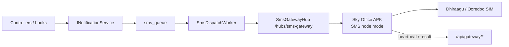

# SMS Gateway

Android SIM devices relay outbound SMS for Sky Office / LEO OS. **No Firebase** — gateways talk to the API over LAN or Tailscale using HTTP + SignalR WebSockets.

Deep related docs: [ANDROID-APPS.md](ANDROID-APPS.md) · [API.md](API.md) · [DATA-MODEL.md](DATA-MODEL.md) · [ARCHITECTURE.md](ARCHITECTURE.md)

---

## Architecture



| Piece | Location |
|-------|----------|
| Schema SQL | `001_sms_notifications.sql` + `002_sms_gateway_default.sql` (embedded; applied on API startup) |
| Tables | `sms_gateways` (+ `is_default`), `sms_queue`, `sms_logs`, `notification_templates` |
| Services | `LeoOs.Infrastructure/Notifications/` |
| Hub | `LeoOs.Api/Hubs/SmsGatewayHub.cs` → `/hubs/sms-gateway` |
| REST | `GatewayController` · `SmsController` |
| Android app | **Sky Office** `/home/adhuhaam/apps/leo-android` · package `com.sky.office` · module `:feature-sms-gateway` |
| Web ops | Superuser → **SMS Gateways** (`/sms-gateways`) |
| Live status | Superuser → **About System** (`/about-system`) → SMS gateway card |

**Rule:** business code never sends SMS directly. Always `INotificationService` → queue.

---

## Schema bootstrap

On API start, `NotificationSchemaBootstrap.EnsureCreatedAsync` runs the embedded SQL via ADO.NET (not `ExecuteSqlRaw`, which breaks on `{name}` placeholders in template seeds).

Success log: `SMS notification schema ensured`.

Manual apply (if needed):

```bash
docker exec -i postgres psql -U leoos -d leoos \
  < /home/adhuhaam/apps/leo-os-dotnet/LeoOs.Infrastructure/Sql/001_sms_notifications.sql
```

Seeded templates:

| Code | Purpose |
|------|---------|
| `PermitExpiring` | Work permit expiring soon |
| `LoaCreated` | Letter of Appointment created |
| `EmployeeCreated` | Employee record created (hook reserved) |
| `OrgFollowUp` | Organization phone follow-up (Settings → company phone) |

---

## Multi-device nodes + default

Multiple Android phones can register as gateways. Exactly **one** may be `is_default`:

- Dispatch prefers an **online default**; if offline, falls back to another online standby
- Superuser sets default on **SMS Gateways** (`POST /api/gateway/{id}/set-default`)
- Failover ops model: when the default phone dies, mark another node as default
- Devices poll `GET /gateway/config` for role (default vs standby)

**Organization phone** (`app_settings.company_phone`):

- `GET /api/sms/org-phone` · `POST /api/sms/notify-org` `{ summary }`
- Product hooks (LOA, permit alerts) can also SMS the org number via `IOrgSmsFollowUp`

---

## Queue lifecycle

Statuses: `Pending` → `Sending` → `Sent` | `Failed` | `Cancelled`

`SmsDispatchWorker` (hosted service):

1. Claims next `Pending` (or due retry)
2. Selects gateway: **online default**, else online standby (priority)
3. Pushes SignalR `SendSms` `{ queueId, recipient, message }`
4. Device sends via `SmsManager`, then `SmsCompleted` / `SmsFailed`
5. Retries roughly **30s → 2m → fail** when the gateway is offline or send fails

---

## REST contract

Base: `{server}/api` (e.g. `http://100.126.222.96/api`).

### Device (gateway key auth)

| Method | Path | Body / query |
|--------|------|----------------|
| `POST` | `/gateway/register` | `{ name, description?, phoneNumber?, deviceId?, deviceModel?, androidVersion?, appVersion?, tailscaleIp? }` |
| | | **Response:** `{ id, name, gatewayKey, hubPath, heartbeatIntervalSeconds }` — **store `gatewayKey` once** |
| `POST` | `/gateway/heartbeat` | `{ gatewayId, gatewayKey, batteryLevel?, signalStrength?, … }` |
| `POST` | `/gateway/result` | `{ gatewayId, gatewayKey, queueId, success, response? }` |
| `GET` | `/gateway/config?gatewayId=&gatewayKey=` | Heartbeat interval, hub path |

### Admin (session: superuser / admin)

| Method | Path | Notes |
|--------|------|--------|
| `GET` | `/gateway` | List + queue/sent/fail counts |
| `GET` | `/gateway/{id}` | Detail |
| `POST` | `/gateway` | Admin create (returns key once) |
| `DELETE` | `/gateway/{id}` | Remove |
| `POST` | `/gateway/{id}/set-default` | Mark exclusive default node |
| `GET` | `/sms/org-phone` | Organization SMS number |
| `POST` | `/sms/notify-org` | `{ summary }` → `OrgFollowUp` template |
| `POST` | `/sms/send` | `{ recipient, message }` or `{ recipient, templateCode, … }` |
| `POST` | `/sms/sendbulk` | `{ messages: [...] }` |
| `GET` | `/sms/pending` | Open queue rows |
| `GET` | `/sms/logs?take=` | Delivery audit |
| `GET` | `/sms/statistics` | Counts |
| `GET` | `/sms/templates` | Template list |

---

## SignalR hub

**URL:** `{server}/hubs/sms-gateway?gatewayId={id}&gatewayKey={key}`

| Direction | Method / event | Payload |
|-----------|----------------|---------|
| Server → device | `SendSms` | `{ queueId, recipient, message }` |
| Device → server | `Heartbeat` | Telemetry DTO (battery, SIM, …) |
| Device → server | `SmsCompleted` | `{ queueId, response? }` |
| Device → server | `SmsFailed` | `{ queueId, response? }` |

Nginx must upgrade WebSockets for `/hubs/` (`react/nginx/default.conf` + `infra/nginx/leo-os-docker.conf`).

---

## Product hooks (v1)

| Trigger | Template | Recipient | Cooldown |
|---------|----------|-----------|----------|
| `POST /api/loa` success | `LoaCreated` | LOA emergency contact or company phone | None (once per create) |
| `GET /api/passports/work-permit-alerts` finds `expiring_soon` | `PermitExpiring` | Passport `emergency_contact_phone` | **7 days** per passport (`reference_type=permit_expiry`) |

---

## Configure a phone

1. Build/install **Sky Office** (`com.sky.office`) — see [ANDROID-APPS.md](ANDROID-APPS.md).
2. Open the bottom tab **SMS** (or notification tap when already a node).
3. Server URL: `http://100.126.222.96` (Tailscale) or `http://192.168.x.x` (LAN).
4. Register with a display name; save returned **gateway key**.
5. Grant `SEND_SMS`, phone state, notifications; exempt from OEM battery killers (Xiaomi/Samsung).
6. Foreground service keeps SignalR + ~30s heartbeat.

---

## Ops checklist

- [ ] About System SMS card / `/sms-gateways` shows gateway **online**
- [ ] Test send from web → queue `Pending` → `Sending` → `Sent`
- [ ] Heartbeat refreshes battery / last seen
- [ ] Kill app / airplane mode → retries then `Failed`
- [ ] API log line: `SMS notification schema ensured` after recreate
- [ ] No loops of `relation "sms_*" does not exist`

## Troubleshooting

| Symptom | Fix |
|---------|-----|
| `sms_gateways` missing | Re-run SQL or recreate `leo-api-dotnet` after bootstrap fix |
| Hub won’t connect | Check `/hubs/` Upgrade headers on proxy + cleartext URL |
| Register works, never online | Permissions / OEM kill / SignalR URL typo |
| Queued forever | No online gateway; open Sky Office → **SMS** tab |
| About SMS card empty / error | Ensure tables exist; hard-refresh PWA |
