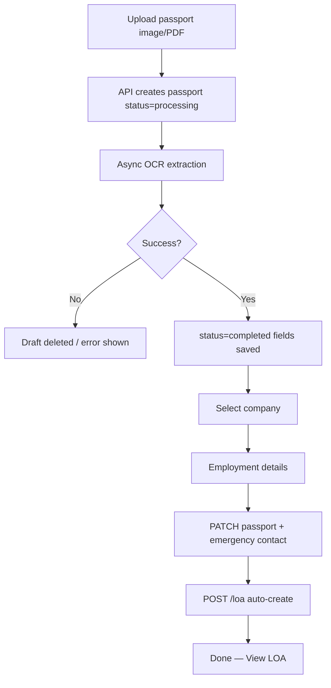
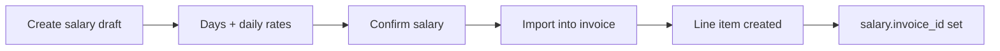

# Workflows

End-to-end business processes in LEO OS.

---

## 1. New employee via passport OCR



### Web

1. **Process Document** (`/upload`)
2. Upload → wait for extraction → review fields
3. Choose company → fill employment (LOA options dropdowns)
4. **Complete** → LOA created automatically
5. If emergency/company phone present → SMS `LoaCreated` may enqueue (needs online gateway)

### Mobile

1. Native **leo-android** Upload (Expo reference until parity) → camera / gallery / PDF
2. Extract → assign company
3. Save to master list → PATCH company + POST LOA

### Tables written

| Step | Tables |
|------|--------|
| Upload | `passports` |
| Complete | `passports.company_id`, emergency fields |
| LOA | `loa_entries` (one per passport) |

---

## 2. Employee edit & LOA sync

1. Master List → Edit, or open Employee Profile
2. Update passport, company, client, employment fields
3. Emergency contact editable on edit flows
4. `PATCH /api/passports/:id`
5. If emergency contact changed → linked LOA `candidate_emergency_contact` updated

Employment dropdowns: `GET /api/loa-options?companyId=` filtered by category (`job_title`, `work_type`, `work_site`).

---

## 3. Salary → invoice



1. Salary page — monthly record linked to passport
2. Set `basicSalary`, `clientSalary`, `daysWorked` (+ allowances/deductions)
3. Confirm → `status=confirmed`, `netSalary` computed server-side
4. Billing → new invoice → import confirmed salaries
5. Line: `Salary — NAME (JOB TITLE)`, qty=days, rate=`clientSalary`

Math: `apps/api/src/lib/money.ts`.

---

## 4. Work permit monitoring

1. Passport must have `work_permit_number` + `passport_number`
2. Dashboard alerts call `GET /api/passports/work-permit-alerts`
3. Classification:
   - **Expired** — expiry before today
   - **Expiring soon** — within next 3 calendar months
4. Employer name from Xpat (not internal company)
5. **SMS (optional):** for each `expiring_soon` with `emergency_contact_phone`, enqueue template `PermitExpiring` via `INotificationService` if no `permit_expiry` queue row in the last **7 days**

---

## 4b. Outbound SMS via Android gateway

1. Feature calls `INotificationService.SendSms*` → `sms_queue`
2. `SmsDispatchWorker` claims Pending → SignalR `SendSms` to an online gateway
3. `leo-sms-gateway` sends SIM SMS → `SmsCompleted` / `SmsFailed`
4. Ops visibility: `/sms-gateways`, About System SMS card, `sms_logs`

Product hooks today: LOA create (`LoaCreated`), permit alerts (`PermitExpiring`). Details: [SMS-GATEWAY.md](SMS-GATEWAY.md).

---

## 5. Company setup

1. Companies → Add (name, address, branding, signatory)
2. Auto: blank `passwords` row
3. Detail dialog → configure Job Titles, Work Types, Work Sites
4. Options appear in OCR wizard and employee edit

---

## 6. LOA view / print

- LOA list → View → `/loa/:id/print`
- Mobile opens same URL in browser
- Browser Print / Save as PDF
- API: `GET /api/loa/:id/pdf`

Legacy: **Generate LOA** on LOA page if missing.

---

## 7. Billing document lifecycle

| Status | Meaning |
|--------|---------|
| `draft` | Editable |
| `sent` | Outstanding (dashboard KPI) |
| `payment_received` | Paid |
| `completed` | Closed |
| `voided` | Cancelled |

---

## 8. Expense recording

1. Categories exist (seeded on bootstrap; manage in Settings)
2. Expenses → Add (category, amount, date, remarks)
3. Dashboard chart aggregates by month
4. Optional voucher print

---

## 9. Deploy a web or API change

See [DEPLOYMENT.md](DEPLOYMENT.md).

```bash
# Web
cd /home/adhuhaam/apps/leo-os && pnpm deploy:web

# API
cd /home/adhuhaam/apps
docker compose build leo-api
docker compose up -d --force-recreate leo-api
```
