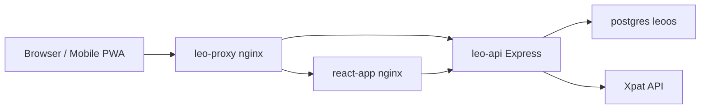

# LEO OS

LEO OS is an internal operations platform for employment agencies: passport OCR processing, master employee lists, letters of appointment (LOA), billing, expenses, salary, work permit monitoring, and user/permission management. The web app is the primary admin UI (installable PWA); a React Native (Expo) mobile app shares the same API.

## Monorepo structure

| Path | Package | Description |
|------|---------|-------------|
| `apps/web` | `@leo/web` | Vite + React web admin UI (PWA) |
| `apps/api` | `@leo/api` | Express REST API |
| `apps/mobile` | `@leo/mobile` | Expo React Native app |
| `packages/db` | `@leo/db` | Drizzle ORM schema, Postgres pool |
| `packages/api-client-react` | `@leo/api-client-react` | Shared React Query API hooks |

## Quick start (local)

```bash
cd /home/adhuhaam/apps/leo-os
pnpm install

# API (needs DATABASE_URL, SESSION_SECRET — see apps/api)
pnpm --filter @leo/api run dev

# Web (proxies /api to the API in dev)
pnpm --filter @leo/web run dev

# Mobile (Expo)
pnpm mobile:dev
```

## Production deploy

```bash
# Web → /home/adhuhaam/apps/react/app/
cd /home/adhuhaam/apps/leo-os && pnpm deploy:web

# API Docker container
cd /home/adhuhaam/apps && docker compose build leo-api && docker compose up -d --force-recreate leo-api
```

Stack: **leo-proxy** (TLS) → **react-app** (nginx static) → **leo-api** → **postgres**.

## Documentation

**Canonical system docs** (homelab + application): [`/home/adhuhaam/apps/docs/`](../docs/)

| Doc | Contents |
|-----|----------|
| [../docs/README.md](../docs/README.md) | Index for the full documentation set |
| [docs/FEATURES.md](docs/FEATURES.md) | App-focused module notes (also covered in `apps/docs`) |
| [docs/WORKFLOWS.md](docs/WORKFLOWS.md) | End-to-end flows |
| [docs/DATA-MODEL.md](docs/DATA-MODEL.md) | Database tables, relationships, API joins |
| [docs/ARCHITECTURE.md](docs/ARCHITECTURE.md) | Auth, API routes, OCR pipeline, shared packages |
| [docs/DEPLOYMENT.md](docs/DEPLOYMENT.md) | Deploy web, API, mobile, env vars, checklist |
| [AGENTS.md](AGENTS.md) | Guidance for AI assistants and contributors |

## Architecture overview



Session cookies (`leo.sid`) authenticate API requests. Public routes (health, branding metadata, print views) skip auth.

## Key capabilities

- **Passport OCR** — upload → extract → company → employment details → auto LOA
- **Master list** — employees with Xpat photos, WP status, job titles
- **Work permit alerts** — expired / expiring soon from live Xpat data
- **LOA** — auto-generated on upload; view/print; emergency contact sync
- **Billing & salary** — invoices with salary import; job title on line items
- **Expenses** — categorized tracking with dashboard charts
- **Company passwords** — Efaas + Gmail credentials per company
- **Tasks** — dashboard task manager with subtasks
- **PWA** — installable web app with offline service worker

## Scripts

| Script | Action |
|--------|--------|
| `pnpm build` | Build all packages |
| `pnpm typecheck` | Typecheck all packages |
| `pnpm deploy:web` | Build web and rsync to production static dir |
| `pnpm mobile:dev` | Start Expo dev server |

## Environment variables

See [docs/DEPLOYMENT.md](docs/DEPLOYMENT.md#environment-variables) for the full list. Core API vars: `DATABASE_URL`, `SESSION_SECRET`, `OPENAI_API_KEY`.
