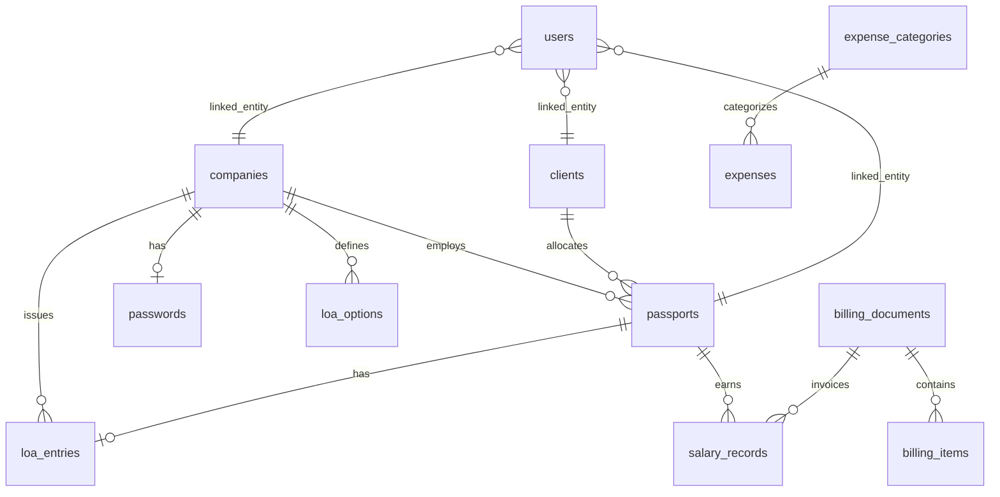

# Data Model

Schema lives in `packages/db/src/schema/`. Drizzle ORM; Postgres database `leoos`.

Migrations: `packages/db/drizzle/` + runtime `ALTER TABLE IF NOT EXISTS` in `apps/api/src/lib/bootstrap.ts`.

---

## Entity relationships

---

## Core tables

### `passports` (employees / candidates)

| Column | Type | Notes |
|--------|------|-------|
| `id` | serial | PK |
| `full_name`, `passport_number` | text | From OCR |
| `date_of_birth`, `date_of_issue`, `date_of_expiry` | text | ISO or DD/MM/YYYY |
| `address` | text | |
| `emergency_contact_name` | text | OCR or manual |
| `emergency_contact_phone` | text | OCR or manual |
| `nationality` | text | bangladesh, india, … |
| `status` | text | processing, completed, failed |
| `submitted` | boolean | Workflow flag |
| `company_id` | FK → companies | Recruiting company |
| `client_id` | FK → clients | Allocated employer |
| `work_permit_number` | text | For Xpat lookup |
| `agency_salary`, `client_salary`, `agent_rate` | numeric | Daily rates |
| `employee_type` | text | casual, permanent, … |

### `loa_entries`

One LOA per passport (enforced at API). Employment fields:

- `job_title`, `work_type`, `work_site`
- `basic_salary`, `salary_payment_date`, `working_hours`, `work_status`, `contract_duration`
- `candidate_emergency_contact` — formatted `"Name, Phone"`

Joined to passports for master list `jobTitle` display.

### `loa_options`

Company-specific dropdown values: `category` = `job_title` | `work_type` | `work_site`.

### `companies`

Name, address, contact, branding images, signatory, bank details, registration number.

### `clients`

Employer clients (resorts, etc.).

### `passwords`

One row per company (unique `company_id`): Efaas + Gmail credentials.

### `salary_records`

| Column | Notes |
|--------|-------|
| `passport_id` | FK |
| `month`, `year` | Period |
| `days_worked` | Required on confirm |
| `basic_salary` | Employee daily rate |
| `client_salary` | Client daily rate |
| `net_salary` | Computed on save |
| `status` | draft, confirmed |
| `invoice_id` | Set when imported to billing |

API join returns `jobTitle` from `loa_entries` for invoice labels.

### `billing_documents` + `billing_items`

Invoice/quotation header + line items. GST fields, status, linked salary IDs.

### `expenses` + `expense_categories`

Amount, date, category, remarks.

### `tasks`

Title, notes, status, priority, due date, parent_id (subtasks).

### `users` + `role_permissions` + `session`

Auth and RBAC. `linked_entity_id` scopes company/client/employee users.

### `app_settings`

Singleton row: branding, OCR API configuration.

---

## Computed / derived data (not stored)

| Data | Source |
|------|--------|
| Xpat work permit status | Live API via `apps/api/src/lib/xpat.ts` |
| Work permit alerts | Aggregated from Xpat + passport WP numbers |
| Billing profit | `client bill − salary cost` from linked records |
| Dashboard charts | Client-side aggregation of expenses/billing by month |

---

## Key API joins

| Endpoint | Join | Purpose |
|----------|------|---------|
| `GET /passports` | `loa_entries` on `passport_id` | `jobTitle` in master list |
| `GET /salary-records` | `passports` + `loa_entries` | `passportNumber`, `jobTitle` for invoices |
| `GET /passports/work-permit-alerts` | passports + Xpat | Expiry alerts |
