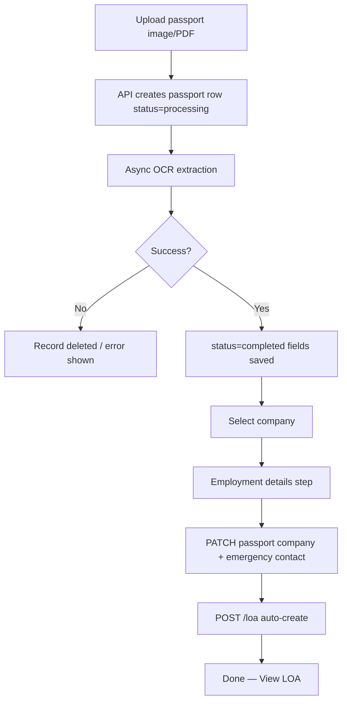

# Workflows

End-to-end flows for the main business processes in LEO OS.

---

## 1. New employee via passport OCR

### Web steps

1. Go to **Process Document** (`/upload`)
2. Upload file → wait for extraction
3. Review extracted fields (including emergency contact if present)
4. Choose company
5. Fill employment details (job title, work type, work site from company LOA options)
6. Click **Complete** → LOA created automatically

### Mobile steps

1. **Passport upload** tab → pick camera/gallery/PDF
2. Extract → assign company
3. **Save to master list** → PATCH company + POST LOA with passport data

### Data written

| Step | Tables |
|------|--------|
| Upload | `passports` (OCR fields) |
| Complete | `passports.company_id`, emergency fields |
| LOA | `loa_entries` (one per passport) |

---

## 2. Employee edit & LOA sync

1. Open **Master List** → Edit or **Employee Profile**
2. Update passport fields, company, client, employment fields
3. Emergency contact name/phone editable separately
4. On save: `PATCH /api/passports/:id`
5. If emergency contact changed → linked LOA `candidate_emergency_contact` updated

Employment dropdowns (`jobTitle`, `workType`, `workSite`) pull from `GET /api/loa-options?companyId={id}` filtered by category.

---

## 3. Salary → Invoice

1. **Salary** page — create monthly record for employee (linked to passport)
2. Set `basicSalary` (employee daily rate), `clientSalary` (client daily rate), `daysWorked`
3. Confirm → `status=confirmed`, `netSalary` computed server-side
4. **Billing** → new invoice → import confirmed salary records for client/month
5. Line item: `Salary — NAME (JOB TITLE)` with qty=days, rate=clientSalary

Math source of truth: `apps/api/src/lib/money.ts`.

---

## 4. Work permit monitoring

1. Employee must have `work_permit_number` and `passport_number` on passport record
2. Dashboard **Work permit alerts** card calls `GET /api/passports/work-permit-alerts`
3. API queries Xpat per employee, classifies expiry:
   - **Expired** — expiry date before today
   - **Expiring soon** — within next 3 calendar months
4. Employer name shown from Xpat (not internal company name)

Employee profile also shows full Xpat panel when WP numbers are set.

---

## 5. Company setup

1. **Companies** → Add company (name, address, branding, signatory)
2. Auto: blank **password** record created (`passwords` table)
3. Open company detail → configure **Job Titles**, **Work Types**, **Work Sites** (LOA options)
4. These options appear in OCR wizard step 3 and employee edit

---

## 6. LOA view / print

- **LOA list** → **View** opens `/loa/:id/print`
- Mobile opens same URL in in-app browser
- Print / Save as PDF from browser
- API PDF download: `GET /api/loa/:id/pdf`

Legacy employees without LOA: use **Generate LOA** on LOA page.

---

## 7. Billing document lifecycle

| Status | Meaning |
|--------|---------|
| `draft` | Editable, not sent |
| `sent` | Outstanding (counts in dashboard KPI) |
| `payment_received` | Paid |
| `completed` | Closed |
| `voided` | Cancelled |

Create → edit lines → set client → send → record payment.

---

## 8. Expense recording

1. Ensure expense categories exist (seeded on bootstrap)
2. **Expenses** → Add with category, amount, date, remarks
3. Dashboard chart shows monthly totals (one bar per expense record)
4. Optional voucher print
